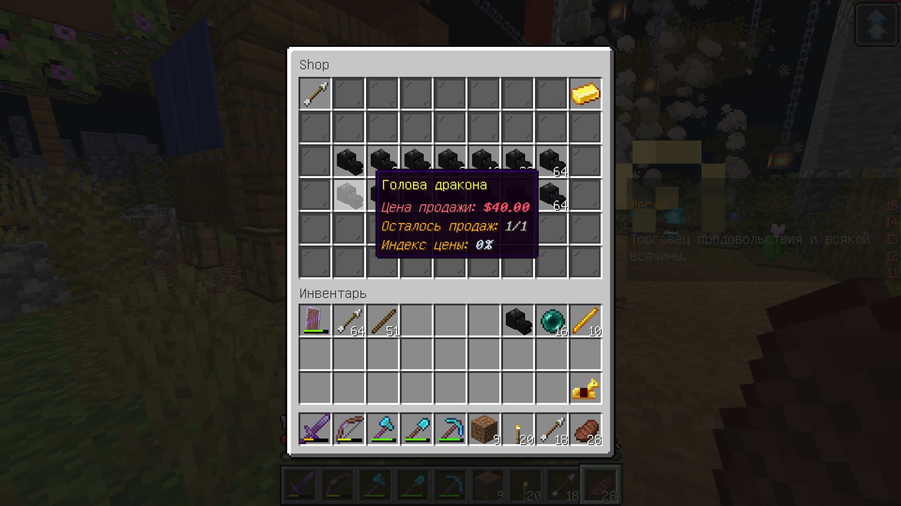
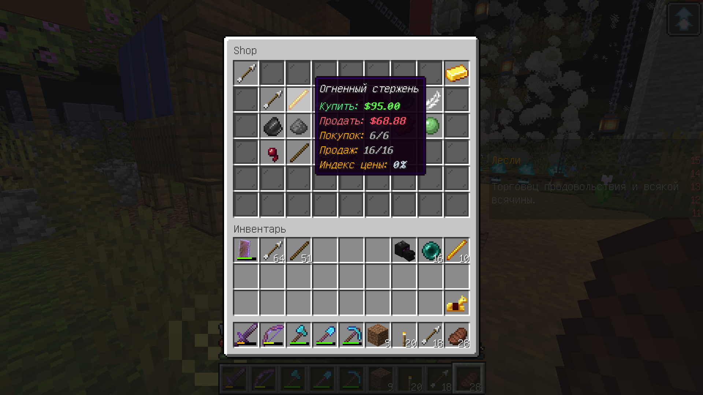

# Баг №1 Не соответствие награды в квесте на добычу призмарина #2

__Предшевствующие условия:__ 
1. Выполнить квест на добычу призмарина #1

__Шаги воспроизведения:__
1. Открыть меню Гильдии квестов
2. Выбрать квест на добычу призмарина #2

__Ожидаемый результат:__ Награда за "Квест на добычу призмарина #2" отображается выше, чем награда за квест перового уровня, т.е. выше 250 тугриков.

__Фактические результат:__ Награда за "Квест на добычу призмарина #2" отображается в 50 тугриков, что в 5 раз ниже квеста перового уровня.

__Серьёзность:__ Minor (Незначительный)

# Баг №2 Не корректная стоимость продажи некоторых товаров, у торговца "Лесли"

__Шаги воспроизведения:__
1. Открыть меню серверного магазина у нпс Лесли, выбрав "1. Покажи свой товар"
2. Зайти в раздел "Разное"
3. Посмотреть стоимость покупки и стомость продажи "Головы дракона"
4. Изучить и проанализировать стоимость у других предметов

__Ожидаемый результат:__ Вся стоимость продажи товаров соответствует здравому смыслу, а также `Индексу цен`. Приблизетельная стоимость головы Дракона ~ >= 2400.00 $ (по примеру цены Звезды незера, т.е. 60 % от стоимости покупки)

__Фактический результат:__ Стоимость головы Дракона, не соответствует ожиданиям и здравому смыслу = 40.00 $. 
Также некорректна стоимость продажи, некоторых товаров в категориях:
- Руда (к примеру Изумруд, Золотой слиток и др)
- Еда
- Растения
- Разное (Голова дракона, Роза визера, Порох) 

__Серьёзность:__ Minor (Незначительный)

Стоимость продажи головы дракона: 40 $

В то время, как стоимость продажи нефрита 68 $, что не логично, учитывая лёгкость добычи данного ресурса
